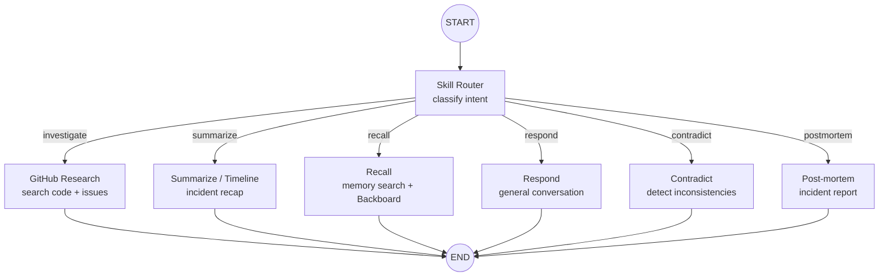

# Architecture

## System Overview

War Room Copilot is a voice-first AI agent for production incident war rooms. It uses a two-loop architecture: a **real-time voice loop** (LiveKit) for audio I/O and a **reasoning loop** (LangGraph) for multi-step investigation, memory, and skill routing.

```mermaid
flowchart LR
    subgraph Meeting Platform
        User[Engineer on Call]
        Platform[LiveKit / Google Meet / Zoom]
    end

    subgraph Voice Loop
        VAD[Silero VAD]
        STT[Speechmatics STT]
        VoiceLLM[Voice LLM\nOpenAI / Anthropic / Google]
        TTS[ElevenLabs TTS]
    end

    subgraph Reasoning Loop – LangGraph
        Router[Skill Router]
        Investigate[GitHub Research\nMCP Client]
        Summarize[Summarize]
        Recall[Recall]
        Respond[Respond]
        State[(IncidentState\nmemory)]
    end

    subgraph Tools Layer
        MCP[GitHubMCPClient]
        MCPServer[GitHub MCP Server\nHTTP sidecar]
        GH[GitHub REST API]
    end

    User -- audio --> Platform
    Platform -- audio --> VAD
    VAD -- voice activity --> STT
    STT -- text + speaker ID --> VoiceLLM
    VoiceLLM -- _invoke_graph --> Router
    Router -. investigate .-> Investigate
    Router -. summarize .-> Summarize
    Router -. recall .-> Recall
    Router -. respond .-> Respond
    Investigate --> MCP
    MCP -- HTTP --> MCPServer
    MCPServer -- REST --> GH
    Investigate -- findings --> State
    Summarize -- findings --> State
    Recall -- findings --> State
    Respond -- message --> State
    State -- result text --> VoiceLLM
    VoiceLLM -- response --> TTS
    TTS -- audio --> Platform
    Platform -- audio --> User
```

## Two-Loop Architecture

The system has two fundamentally different loops with different latency budgets:

### Voice Loop (real-time, ~100ms)

Owned by LiveKit's `AgentSession`. Handles: VAD → STT → LLM → TTS. The voice LLM generates quick conversational responses and decides when to invoke the reasoning loop for deeper investigation.

### Reasoning Loop (async, 2–10s)

Owned by LangGraph. Handles: skill routing → research/summarization/recall → memory accumulation. Called by the voice loop via `_invoke_graph()` when the user asks for investigation, summaries, or recall.

The two loops compose — they don't compete. The voice LLM decides *when* to invoke the reasoning loop, and the reasoning loop returns structured results that the voice LLM speaks.

## LangGraph Incident Investigation Graph



### Shared State (IncidentState)

The graph's `IncidentState` is a `TypedDict` that flows through every node and persists across invocations within a session:

| Field | Type | Purpose |
|-------|------|---------|
| `messages` | `Annotated[list, add_messages]` | Conversation history (appended via reducer) |
| `transcript` | `Annotated[list[str], operator.add]` | Raw STT output with speaker labels |
| `findings` | `Annotated[list[str], operator.add]` | Research results from all nodes |
| `decisions` | `Annotated[list[str], operator.add]` | Tracked decisions made during incident |
| `speakers` | `dict[str, str]` | Speaker ID → display name |
| `routed_skill` | `str` | Which skill the router selected |
| `query` | `str` | The user's current query |

State accumulates across graph invocations via `_session_state` in `livekit.py`, giving the graph memory over the lifetime of the session.

### Nodes

| Node | File | What it does |
|------|------|-------------|
| Skill Router | `graph/nodes/skill_router.py` | LLM-based intent classification → one of: investigate, summarize, recall, respond, contradict, postmortem |
| GitHub Research | `graph/nodes/github_research.py` | Wraps `GitHubMCPClient` — searches code and issues, appends to findings |
| Summarize | `graph/nodes/summarize.py` | Generates concise incident summary or chronological timeline from transcript + findings + decisions |
| Recall | `graph/nodes/recall.py` | Searches accumulated state and Backboard cross-session memory for past decisions and discussion points |
| Respond | `graph/nodes/respond.py` | General conversation with incident context |
| Contradict | `graph/nodes/contradict.py` | Detects factual contradictions, timeline inconsistencies, and circular reasoning in transcript |
| Capture Decision | `graph/nodes/capture_decision.py` | Detects decisions (actions, conclusions, assignments) in transcript utterances |
| Post-mortem | `graph/nodes/postmortem.py` | Generates structured post-mortem report (summary, impact, timeline, root cause, action items) |

### LLM Separation

The system uses two separate LLM instances:

| LLM | Factory | Used by | Interface |
|-----|---------|---------|-----------|
| Voice LLM | `llm.create_llm()` | LiveKit `AgentSession` | LiveKit plugin (OpenAI/Anthropic/Google) |
| Graph LLM | `graph.llm.get_graph_llm()` | LangGraph nodes | LangChain (`ChatOpenAI`/`ChatAnthropic`) |

Both read from the same `LLM_PROVIDER` / `LLM_MODEL` config. The separation exists because LiveKit and LangGraph expect different LLM interfaces.

## Current Stage: 0 + Tools + LangGraph + P1 Features

The agent joins a LiveKit room, detects voice activity via Silero VAD, transcribes speech via Speechmatics (enhanced mode with custom SRE vocabulary, entity detection, and speaker identification), passes it through a configurable LLM, and speaks back via ElevenLabs TTS.

The **LangGraph reasoning layer** provides skill-based routing, GitHub research, incident summarization, timeline generation, contradiction detection, post-mortem generation, memory recall (with Backboard cross-session memory), and general conversation — all backed by persistent session state.

The **tools layer** provides agentic access to GitHub repos via the official GitHub MCP server running in Docker.

The **dashboard API** (FastAPI SSE) streams live transcript, findings, and decisions to a web frontend.

### Features
- Speaker diarization (who said what)
- Speaker identification (recognizes returning speakers via voiceprints saved to `speakers.json`)
- Smart turn detection (knows when someone is done speaking)
- Personalized greetings for known speakers
- Enhanced Speechmatics STT with custom SRE vocabulary (25 domain terms) and entity detection
- GitHub integration: issues, PRs, commits, code search (51 tools via MCP)
- Skill-based routing (investigate, summarize, recall, respond, contradict, postmortem)
- Session memory (findings, decisions, transcript accumulate across interactions)
- **Voice-to-graph bridge**: Voice LLM invokes LangGraph via `reason` function tool for deep reasoning
- **Live transcript capture**: STT events feed timestamped, speaker-tagged lines into session state
- **Contradiction detection**: Background task monitors transcript every 20s for inconsistencies and auto-interjects
- **Decision capture**: Background task detects decisions and confirms them aloud
- **Timeline generation**: Chronological incident timeline from timestamped transcript
- **Post-mortem drafting**: Structured incident report saved to file
- **Cross-session memory**: Backboard.io integration for recall across incidents
- **Dashboard API**: FastAPI SSE endpoint at :8000 for real-time UI streaming

### Components

| Component | File | Purpose |
| --- | --- | --- |
| CLI Entrypoint | `src/war_room_copilot/core/agent.py` | Platform dispatcher (`--platform` flag) |
| Platform Base | `src/war_room_copilot/platforms/base.py` | `MeetingPlatform` protocol, `SpeakerInfo`, shared helpers |
| LiveKit Platform | `src/war_room_copilot/platforms/livekit.py` | LiveKit Agents implementation + LangGraph bridge (`_invoke_graph`) |
| Google Meet Stub | `src/war_room_copilot/platforms/google_meet.py` | Placeholder for Google Meet integration |
| Zoom Stub | `src/war_room_copilot/platforms/zoom.py` | Placeholder for Zoom integration |
| Prompt | `assets/agent.md` | Agent system instructions |
| Config | `src/war_room_copilot/config.py` | Centralized settings via `pydantic-settings` (env vars, timeouts, defaults) |
| Models | `src/war_room_copilot/models.py` | Shared Pydantic models (`GitHubIssue`, `GitHubPR`, `GitHubCommit`, etc.) |
| **Graph** | `src/war_room_copilot/graph/incident_graph.py` | **LangGraph incident investigation graph** |
| **Graph State** | `src/war_room_copilot/graph/state.py` | **`IncidentState` TypedDict — shared memory** |
| **Graph LLM** | `src/war_room_copilot/graph/llm.py` | **LangChain LLM factory for graph nodes** |
| **Skill Router** | `src/war_room_copilot/graph/nodes/skill_router.py` | **Intent classification → skill dispatch** |
| **GitHub Research** | `src/war_room_copilot/graph/nodes/github_research.py` | **Wraps GitHubMCPClient for graph-based research** |
| **Summarize** | `src/war_room_copilot/graph/nodes/summarize.py` | **Incident summary from accumulated state** |
| **Recall** | `src/war_room_copilot/graph/nodes/recall.py` | **Memory search for past decisions** |
| **Respond** | `src/war_room_copilot/graph/nodes/respond.py` | **General conversation with context** |
| **Contradict** | `src/war_room_copilot/graph/nodes/contradict.py` | **Contradiction detection in transcript** |
| **Capture Decision** | `src/war_room_copilot/graph/nodes/capture_decision.py` | **Decision detection in transcript** |
| **Post-mortem** | `src/war_room_copilot/graph/nodes/postmortem.py` | **Structured incident report generation** |
| GitHub MCP Client | `src/war_room_copilot/tools/github_mcp.py` | Async MCP client — streamable HTTP transport, tool invocation, schema conversion |
| GitHub Facade | `src/war_room_copilot/tools/github.py` | `get_repo_context()` — parallel fetch of issues, PRs, commits |
| Backboard Client | `src/war_room_copilot/tools/backboard.py` | Cross-session memory via Backboard.io |
| Dashboard API | `src/war_room_copilot/api/main.py` | FastAPI SSE endpoint for real-time dashboard |

### GitHub MCP Integration


**Key design decisions:**

- MCP server runs as a Docker Compose sidecar — agent connects via HTTP, no Docker socket needed
- MCP tools are dynamically converted to function-calling format via `mcp_tool_to_schema()`
- `asyncio.gather(return_exceptions=True)` — partial failures return empty lists, not crashes
- GitHub token passed via `Authorization: Bearer` header over Docker-internal network
- Error hierarchy: `WarRoomToolError` → `MCPConnectionError` / `MCPServerError` / `GitHubRateLimitError`
- `RepoContext.as_prompt_context()` renders token-efficient text for LLM injection

### Data Flow

1. User speaks into LiveKit room
2. Silero VAD detects voice activity
3. Speechmatics transcribes audio to text with speaker labels (enhanced mode + custom SRE vocab)
4. Transcript handler appends timestamped, speaker-tagged lines to `_session_state`
5. Voice LLM generates response (can invoke reasoning graph via `_invoke_graph()`)
6. Reasoning graph: router classifies intent → dispatches to skill node → returns result
7. Skill nodes accumulate findings/decisions into persistent `IncidentState`
8. ElevenLabs TTS converts response to audio
9. Audio sent back to LiveKit room

### Background Tasks

Five async tasks run in parallel with the voice loop:

| Task | Interval | Purpose |
|------|----------|---------|
| `capture_voiceprints` | 30s | Saves speaker voiceprints for identification |
| `monitor_contradictions` | 20s | Checks transcript for inconsistencies, auto-interjects if confidence > 0.7 |
| `monitor_decisions` | 25s | Detects decisions, appends to state, confirms aloud |
| `sync_to_backboard` | 60s | Flushes findings/decisions to Backboard cross-session memory |
| `start_dashboard_api` | once | Starts FastAPI SSE server on port 8000 |

## Tech Decisions

| Decision | Choice | Rationale |
|----------|--------|-----------|
| Platform abstraction | `MeetingPlatform` Protocol | Swap LiveKit/Meet/Zoom via `--platform` flag |
| Voice framework | LiveKit Agents | Real-time, open-source, good Python SDK |
| STT | Speechmatics | Enhanced mode, diarization, speaker ID, smart turn detection |
| Voice LLM | Configurable (OpenAI/Anthropic/Google) | Swappable via `LLM_PROVIDER` env var; factory in `llm.py` |
| TTS | ElevenLabs | Natural voice quality |
| VAD | Silero | Lightweight, runs locally (ONNX) |
| **Reasoning orchestration** | **LangGraph** | **Declarative graph for skill routing, memory, multi-agent research** |
| **Graph LLM** | **LangChain (ChatOpenAI/ChatAnthropic)** | **Required by LangGraph nodes; reads same config as voice LLM** |
| GitHub integration | GitHub MCP Server | Official, 51 tools out of the box, zero custom API wrappers |
| MCP transport | Streamable HTTP (sidecar) | No Docker socket mount, agent connects over internal network |
| Config management | pydantic-settings | Auto `.env` loading, type coercion, validation |
| Schema conversion | MCP → function-calling schema | Dynamic — new MCP tools automatically available to the LLM |

## Deployment

The entire stack runs via Docker Compose — no local Python, Homebrew, or LiveKit install required:

```bash
cp .env.example .env       # fill in API keys
docker compose up --build
```

This starts three containers:

| Service | Image | Purpose |
| ------- | ----- | ------- |
| `livekit-server` | `livekit/livekit-server` | WebRTC media server (dev mode) |
| `github-mcp-server` | `ghcr.io/github/github-mcp-server` | GitHub API tools via MCP (HTTP transport) |
| `agent` | Built from `Dockerfile` | War Room Copilot agent + dashboard API |

All services communicate over Docker's internal network. The agent connects to the MCP sidecar via HTTP — no Docker socket mount, no Docker CLI inside the container. Runtime data (voiceprints, postmortems) is persisted in a named Docker volume (`speaker-data`) mounted at `/app/data/`.

## Next Steps

1. **Wire LangGraph tools into LiveKit function calling** — expose `_invoke_graph()` as a registered tool in `AgentSession`
2. **Add LangGraph checkpointing** — `MemorySaver` for dev, Postgres/Redis for production persistence
3. **Add contradiction detection node** — parallel monitoring of transcript for factual contradictions
4. **Add Datadog MCP integration** — same pattern as GitHub (HTTP sidecar in Docker Compose)
5. **LangSmith tracing** — set `LANGCHAIN_TRACING_V2=true` for automatic graph execution traces

See [PLAN_V0.md](PLAN_V0.md) for the full roadmap.
