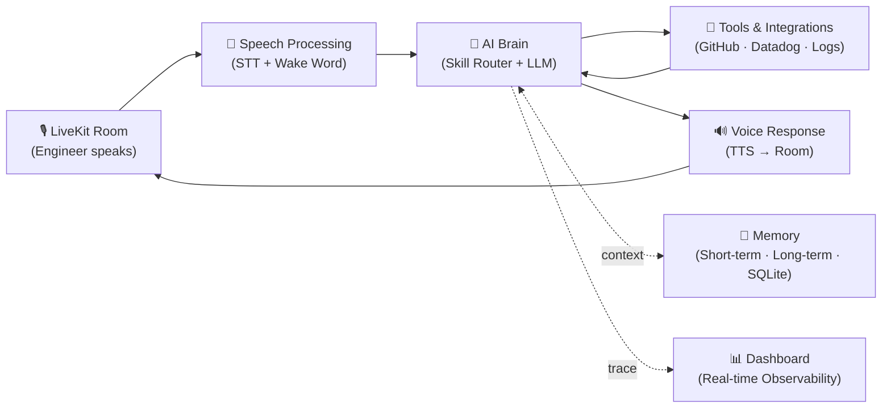
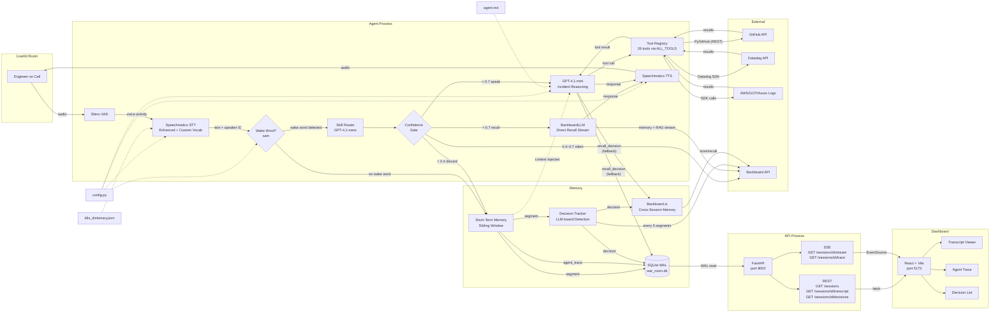

# Architecture

## System Overview

War Room Copilot is a voice-first AI agent for production incident war rooms.

[View interactive diagram on Excalidraw](https://excalidraw.com/#json=G_KFrK6I44OsvE5NKIJDe,gRj6alk5ZwC_y4mul2RIDQ)

## Detailed System Diagram

### Features

#### Voice Pipeline
- Speaker diarization (who said what)
- Speaker identification (recognizes returning speakers via voiceprints saved to `speakers.json`)
- Smart turn detection (knows when someone is done speaking)
- **Wake word activation** — agent silently buffers conversation and only responds when addressed with `"sam"`, then replies with full context awareness
- **Custom vocabulary** for Kubernetes, infrastructure, and incident terms (`assets/k8s_dictionary.json`)

#### AI Reasoning
- **Incident reasoning** — asks clarifying questions, identifies unknowns, suggests next steps, flags contradictions
- **Skill routing** — LLM-based intent classification (5 skills) with confidence gating (speak / silent dashboard push / discard)
- **Multi-LLM ready** — per-skill model config in `config.py` (all default to GPT-4.1-mini, easily swappable)

#### Tools
- **GitHub tools** — search code, recent commits, commit diffs, PRs, issues, read files, blame (via PyGitHub REST API)
- **Datadog tools** — metrics, logs, APM, monitors
- **Cloud log tools** — AWS CloudWatch/ECS/Lambda, GCP GKE, Azure AKS
- **Service graph** — dependency graph and health status
- **Runbook search** — keyword-matched runbook lookup

#### Memory
- **Short-term memory** — structured sliding window of transcript segments with speaker labels and timestamps
- **Long-term memory** — Backboard.io for persistent cross-session recall with auto memory
- **Decision tracking** — LLM-based detection of decisions, action items, and agreements (non-blocking, every 5 segments)
- **SQLite persistence** — local store for call metadata, transcript history, and decisions (`.data/war_room.db`)
- **Recall tool** — `recall_decision` function tool for querying past decisions across sessions (fallback)
- **BackboardLLM direct recall** — for recall skill, streams through Backboard's LLM plugin (memory + RAG) directly to TTS, avoiding the double-LLM path

#### Observability
- **Dynamic prompt** with room name, known speakers, and allowed repos injected
- **Centralized config** — all tunables in `config.py`

### Components

#### Core

| Component | File | Purpose |
|-----------|------|---------|
| Agent | `src/war_room_copilot/core/agent.py` | LiveKit agent entry point, `WarRoomAgent` class |
| Config | `src/war_room_copilot/config.py` | Centralized configuration (model, voice, paths, repos, memory, cost rates) |
| Models | `src/war_room_copilot/models.py` | Pydantic models (`SpeakerMetadata`, `TranscriptSegment`, `Decision`) |
| Prompt | `assets/agent.md` | Agent system instructions (incident reasoning + tools + memory) |

#### Skills

| Component | File | Purpose |
|-----------|------|---------|
| Skill Router | `src/war_room_copilot/skills/router.py` | Intent classification via GPT-4.1-nano (debug, ideate, investigate, recall, general) |
| Skill Prompts | `src/war_room_copilot/skills/prompts.py` | Per-skill prompt suffixes appended to base agent.md |
| Investigation Runner | `src/war_room_copilot/skills/investigation.py` | Background OpenAI tool-calling loop using all 26 tools via `ALL_TOOLS` |

#### Tools

| Component | File | Purpose |
|-----------|------|---------|
| Tool Registry | `src/war_room_copilot/tools/__init__.py` | `ALL_TOOLS` dict of all 26 tools, auto-imported from submodules |
| Tool Utilities | `src/war_room_copilot/tools/_util.py` | Shared `truncate()` and `run_github()` helpers |
| Schema Generator | `src/war_room_copilot/tools/_registry.py` | Auto-generates OpenAI tool schemas from `FunctionTool` metadata |
| GitHub Tools | `src/war_room_copilot/tools/github.py` | 10 `@function_tool` functions for GitHub API (read + write) |
| Datadog Tools | `src/war_room_copilot/tools/datadog.py` | 4 `@function_tool` functions for Datadog metrics, logs, APM, monitors |
| Cloud Log Tools | `src/war_room_copilot/tools/logs.py` | 7 `@function_tool` functions for AWS/GCP/Azure logs |
| Service Graph Tools | `src/war_room_copilot/tools/service_graph.py` | 3 `@function_tool` functions for service dependency graph and health |
| Runbook Tool | `src/war_room_copilot/tools/runbook.py` | `search_runbook` function tool for keyword-matched runbook lookup |
| Recall Tool | `src/war_room_copilot/tools/recall.py` | `recall_decision` function tool for querying past decisions (fallback) |

#### Memory

| Component | File | Purpose |
|-----------|------|---------|
| Short-Term Memory | `src/war_room_copilot/memory/short_term.py` | Sliding window of `TranscriptSegment` objects |
| Long-Term Memory | `src/war_room_copilot/memory/long_term.py` | Backboard.io wrapper for persistent cross-session memory |
| Decision Tracker | `src/war_room_copilot/memory/decisions.py` | LLM-based decision detection via Backboard |
| SQLite DB | `src/war_room_copilot/memory/db.py` | `IncidentDB` for sessions, transcript, decisions, and agent_trace (WAL mode) |
| Backboard LLM Plugin | `src/war_room_copilot/plugins/backboard/` | Vendored LiveKit LLM plugin — streams recall queries directly through Backboard |

#### API

| Component | File | Purpose |
|-----------|------|---------|
| API Server | `src/war_room_copilot/api/main.py` | FastAPI server — REST + SSE observability layer |
| API Dependencies | `src/war_room_copilot/api/deps.py` | FastAPI `Depends(get_db)` for DB dependency injection |
| REST Routes | `src/war_room_copilot/api/routes/sessions.py` | GET /sessions, /transcript, /decisions, /metrics, /analytics, /runbooks, /summary |
| SSE Routes | `src/war_room_copilot/api/routes/stream.py` | SSE /sessions/{id}/stream, /trace, /latest/id |

#### Frontend

| Component | File | Purpose |
|-----------|------|---------|
| Dashboard | `frontend/` | React + Vite — TranscriptViewer, AgentTrace, DecisionList, BusinessMetrics, IssueAnalytics, RunbookPanel |

#### Config & Assets

| Component | File | Purpose |
|-----------|------|---------|
| Dictionary | `assets/k8s_dictionary.json` | Custom vocabulary for Speechmatics STT |
| Runbooks | `mock_data/runbooks.yaml` | 8 SRE runbooks with keywords + steps for keyword-matched suggestions |

### Data Flow

1. User speaks into LiveKit room
2. Silero VAD detects voice activity
3. Speechmatics transcribes audio to text with speaker labels (using Enhanced mode + custom vocab)
4. `on_user_turn_completed` parses speaker tags into `TranscriptSegment`:
   - Stores segment in short-term memory (sliding window) and SQLite
   - Sends segment to Backboard long-term memory (non-blocking)
   - Fires decision check every 5 segments via Backboard LLM (non-blocking)
5. Wake word check (`"sam"`):
   - **No wake word**: `StopResponse` cancels auto-reply
   - **Wake word detected**: proceeds to skill routing
6. Skill Router (GPT-4.1-nano) classifies intent into one of 5 skills with confidence score
7. Confidence gating:
   - **< 0.4**: discard silently
   - **0.4–0.7**: run skill via Backboard (silent), push result to dashboard via `silent_skill_response` trace
   - **> 0.7**: apply skill-specific prompt suffix, inject context, let pipeline speak
8. Dynamic prompt is built with room name, known speaker names, allowed repos, and skill suffix
9. GPT-4.1-mini reasons about the incident; may call GitHub tools or `recall_decision`
10. **Recall skill (direct path):** When the skill router classifies a query as RECALL and BackboardLLM is available, the `llm_node` override routes the query directly through BackboardLLM — one LLM call with built-in memory/RAG, streamed to TTS. Local SQLite decisions are injected as context. Falls back to `recall_decision` tool path on failure.
11. `recall_decision` (fallback) searches SQLite (local decisions) + Backboard (cross-session memory)
12. Speechmatics TTS converts response to audio
13. Audio sent back to LiveKit room
14. Background task captures speaker voiceprints every 30s for future identification
15. On disconnect: session end time stored, resources cleaned up

## Tech Decisions

| Decision | Choice | Rationale |
|----------|--------|-----------|
| Voice framework | LiveKit Agents | Real-time, open-source, good Python SDK |
| STT | Speechmatics (Enhanced) | Enhanced mode for better accuracy, diarization, speaker ID, smart turn detection, custom vocab |
| LLM | GPT-4.1-mini | Fast, cheap, better tool-calling than 4o-mini |
| GitHub tools | PyGitHub (REST) | No local cloning needed, `asyncio.to_thread` for non-blocking |
| TTS | Speechmatics | Single vendor for STT + TTS |
| VAD | Silero | Lightweight, runs locally (ONNX) |
| Short-term memory | `collections.deque` | Simple sliding window, O(1) append, bounded size |
| Long-term memory | Backboard.io | LLM routing + auto memory, persistent across sessions |
| Decision detection | LLM via Backboard | No brittle regex patterns, understands context |
| Local persistence | SQLite (aiosqlite) | Lightweight, async, no server needed |
| Skill classification | GPT-4.1-nano | Fast (~300ms), cheap, LLM-based over keywords for intent nuance |
| Config | Plain Python module | Simple, no framework needed, easy to override |
| Models | Pydantic | Type safety at boundaries, validation |

## Future

Auto-interjection, contradiction detection, advanced analytics.
