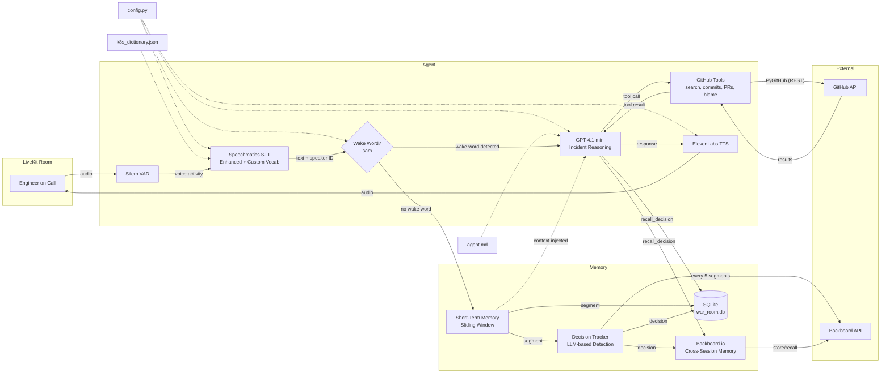

# Architecture

## System Overview

War Room Copilot is a voice-first AI agent for production incident war rooms.

## Current Stage: 3

The agent joins a LiveKit room, transcribes speech via Speechmatics (with diarization, speaker identification, enhanced operating point, and custom vocabulary for k8s/infra terms), stores transcript in structured short-term memory and SQLite, detects decisions via LLM through Backboard, persists cross-session memory via Backboard.io, reasons about the incident via GPT-4.1-mini with GitHub and recall tools, and speaks back via ElevenLabs TTS.

### Features
- Speaker diarization (who said what)
- Speaker identification (recognizes returning speakers via voiceprints saved to `speakers.json`)
- Smart turn detection (knows when someone is done speaking)
- **Wake word activation** — agent silently buffers conversation and only responds when addressed with `"sam"`, then replies with full context awareness
- **Custom vocabulary** for Kubernetes, infrastructure, and incident terms (`assets/k8s_dictionary.json`)
- **Incident reasoning** — asks clarifying questions, identifies unknowns, suggests next steps, flags contradictions
- **GitHub tools** — search code, recent commits, commit diffs, PRs, issues, read files, blame (via PyGitHub REST API)
- **Short-term memory** — structured sliding window of transcript segments with speaker labels and timestamps
- **Long-term memory** — Backboard.io for persistent cross-session recall with auto memory
- **Decision tracking** — LLM-based detection of decisions, action items, and agreements (non-blocking, every 5 segments)
- **SQLite persistence** — local store for call metadata, transcript history, and decisions (`.data/war_room.db`)
- **Recall tool** — `recall_decision` function tool for querying past decisions across sessions
- **Dynamic prompt** with room name, known speakers, and allowed repos injected
- **Centralized config** — all tunables in `config.py`

### Components

| Component | File | Purpose |
|-----------|------|---------|
| Agent | `src/war_room_copilot/core/agent.py` | LiveKit agent entry point, `WarRoomAgent` class |
| GitHub Tools | `src/war_room_copilot/tools/github.py` | 7 `@function_tool` functions for GitHub API access |
| Recall Tool | `src/war_room_copilot/tools/recall.py` | `recall_decision` function tool for querying past decisions |
| Short-Term Memory | `src/war_room_copilot/memory/short_term.py` | Sliding window of `TranscriptSegment` objects |
| Long-Term Memory | `src/war_room_copilot/memory/long_term.py` | Backboard.io wrapper for persistent cross-session memory |
| Decision Tracker | `src/war_room_copilot/memory/decisions.py` | LLM-based decision detection via Backboard |
| SQLite DB | `src/war_room_copilot/memory/db.py` | `IncidentDB` for sessions, transcript, and decisions |
| Config | `src/war_room_copilot/config.py` | Centralized configuration (model, voice, paths, repos, memory) |
| Models | `src/war_room_copilot/models.py` | Pydantic models (`SpeakerMetadata`, `TranscriptSegment`, `Decision`) |
| Prompt | `assets/agent.md` | Agent system instructions (incident reasoning + tools + memory) |
| Dictionary | `assets/k8s_dictionary.json` | Custom vocabulary for Speechmatics STT |

### Data Flow

1. User speaks into LiveKit room
2. Silero VAD detects voice activity
3. Speechmatics transcribes audio to text with speaker labels (using Enhanced mode + custom vocab)
4. `on_user_turn_completed` parses speaker tags into `TranscriptSegment`:
   - Stores segment in short-term memory (sliding window) and SQLite
   - Sends segment to Backboard long-term memory (non-blocking)
   - Fires decision check every 5 segments via Backboard LLM (non-blocking)
5. Wake word check (`"sam"`):
   - **No wake word**: `StopResponse` cancels auto-reply
   - **Wake word detected**: buffered context from short-term memory is injected into chat context, then cleared
6. Dynamic prompt is built with room name, known speaker names, and allowed repos
7. GPT-4.1-mini reasons about the incident; may call GitHub tools or `recall_decision`
8. `recall_decision` searches SQLite (local decisions) + Backboard (cross-session memory)
9. ElevenLabs TTS converts response to audio
10. Audio sent back to LiveKit room
11. Background task captures speaker voiceprints every 30s for future identification
12. On disconnect: session end time stored, resources cleaned up

## Tech Decisions

| Decision | Choice | Rationale |
|----------|--------|-----------|
| Voice framework | LiveKit Agents | Real-time, open-source, good Python SDK |
| STT | Speechmatics (Enhanced) | Enhanced mode for better accuracy, diarization, speaker ID, smart turn detection, custom vocab |
| LLM | GPT-4.1-mini | Fast, cheap, better tool-calling than 4o-mini |
| GitHub tools | PyGitHub (REST) | No local cloning needed, `asyncio.to_thread` for non-blocking |
| TTS | ElevenLabs | Natural voice quality |
| VAD | Silero | Lightweight, runs locally (ONNX) |
| Short-term memory | `collections.deque` | Simple sliding window, O(1) append, bounded size |
| Long-term memory | Backboard.io | LLM routing + auto memory, persistent across sessions |
| Decision detection | LLM via Backboard | No brittle regex patterns, understands context |
| Local persistence | SQLite (aiosqlite) | Lightweight, async, no server needed |
| Config | Plain Python module | Simple, no framework needed, easy to override |
| Models | Pydantic | Type safety at boundaries, validation |

## Planned (Future Stages)

See [PLAN_V0.md](PLAN_V0.md) for the full roadmap: skills router, multi-LLM, auto-interjection, contradiction detection, dashboard, Datadog integration.
