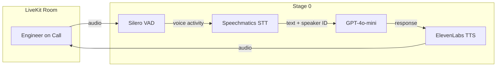

# Architecture

## System Overview

War Room Copilot is a voice-first AI agent for production incident war rooms.

## Current Stage: 0

The agent joins a LiveKit room, detects voice activity via Silero VAD, transcribes speech via Speechmatics (with diarization and speaker identification), passes it through GPT-4o-mini, and speaks back via ElevenLabs TTS.

### Features
- Speaker diarization (who said what)
- Speaker identification (recognizes returning speakers via voiceprints saved to `speakers.json`)
- Smart turn detection (knows when someone is done speaking)
- Personalized greetings for known speakers

### Components

| Component | File | Purpose |
|-----------|------|---------|
| Agent | `src/war_room_copilot/core/agent.py` | LiveKit agent entry point, `WarRoomAgent` class |
| Prompt | `assets/agent.md` | Agent system instructions |

### Data Flow

1. User speaks into LiveKit room
2. Silero VAD detects voice activity
3. Speechmatics transcribes audio to text with speaker labels
4. GPT-4o-mini generates response
5. ElevenLabs TTS converts response to audio
6. Audio sent back to LiveKit room
7. Background task captures speaker voiceprints every 30s for future identification

## Tech Decisions

| Decision | Choice | Rationale |
|----------|--------|-----------|
| Voice framework | LiveKit Agents | Real-time, open-source, good Python SDK |
| STT | Speechmatics | Enhanced mode, diarization, speaker ID, smart turn detection |
| LLM | GPT-4o-mini | Fast, cheap, good enough for Stage 0 |
| TTS | ElevenLabs | Natural voice quality |
| VAD | Silero | Lightweight, runs locally (ONNX) |

## Planned (Future Stages)

See [PLAN_V0.md](PLAN_V0.md) for the full roadmap: skills router, memory, tools (GitHub, Datadog), dashboard, auto-interjection, contradiction detection.
