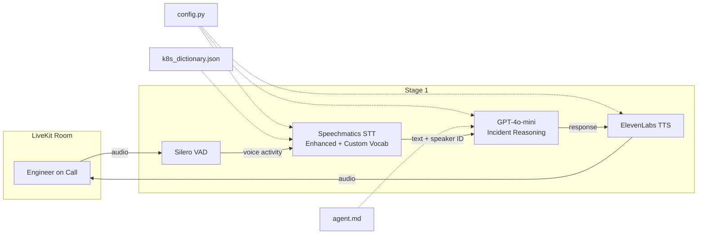

# Architecture

## System Overview

War Room Copilot is a voice-first AI agent for production incident war rooms.

## Current Stage: 1

The agent joins a LiveKit room, transcribes speech via Speechmatics (with diarization, speaker identification, enhanced operating point, and custom vocabulary for k8s/infra terms), reasons about the incident via GPT-4o-mini, and speaks back via ElevenLabs TTS.

### Features
- Speaker diarization (who said what)
- Speaker identification (recognizes returning speakers via voiceprints saved to `speakers.json`)
- Smart turn detection (knows when someone is done speaking)
- Personalized greetings for known speakers
- **Custom vocabulary** for Kubernetes, infrastructure, and incident terms (`assets/k8s_dictionary.json`)
- **Incident reasoning** — asks clarifying questions, identifies unknowns, suggests next steps, flags contradictions
- **Dynamic prompt** with room name and known speakers injected
- **Centralized config** — all tunables in `config.py`

### Components

| Component | File | Purpose |
|-----------|------|---------|
| Agent | `src/war_room_copilot/core/agent.py` | LiveKit agent entry point, `WarRoomAgent` class |
| Config | `src/war_room_copilot/config.py` | Centralized configuration (model, voice, paths, timings) |
| Models | `src/war_room_copilot/models.py` | Pydantic models (`SpeakerMetadata`, `TranscriptSegment`) |
| Prompt | `assets/agent.md` | Agent system instructions (incident reasoning) |
| Dictionary | `assets/k8s_dictionary.json` | Custom vocabulary for Speechmatics STT |

### Data Flow

1. User speaks into LiveKit room
2. Silero VAD detects voice activity
3. Speechmatics transcribes audio to text with speaker labels (using Enhanced mode + custom vocab)
4. Dynamic prompt is built with room name and known speaker names
5. GPT-4o-mini reasons about the incident and generates a response
6. ElevenLabs TTS converts response to audio
7. Audio sent back to LiveKit room
8. Background task captures speaker voiceprints every 30s for future identification

## Tech Decisions

| Decision | Choice | Rationale |
|----------|--------|-----------|
| Voice framework | LiveKit Agents | Real-time, open-source, good Python SDK |
| STT | Speechmatics (Enhanced) | Enhanced mode for better accuracy, diarization, speaker ID, smart turn detection, custom vocab |
| LLM | GPT-4o-mini | Fast, cheap, good enough for Stage 1 |
| TTS | ElevenLabs | Natural voice quality |
| VAD | Silero | Lightweight, runs locally (ONNX) |
| Config | Plain Python module | Simple, no framework needed, easy to override |
| Models | Pydantic | Type safety at boundaries, validation |

## Planned (Future Stages)

See [PLAN_V0.md](PLAN_V0.md) for the full roadmap: skills router, memory, tools (GitHub, Datadog), dashboard, auto-interjection, contradiction detection.
