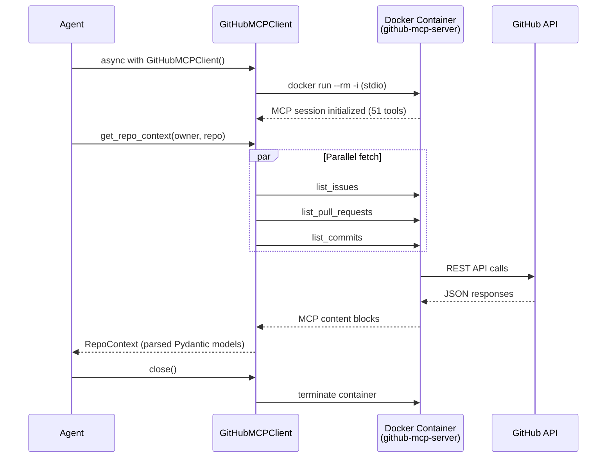

# Architecture

## System Overview

War Room Copilot is a voice-first AI agent for production incident war rooms.

```mermaid
flowchart LR
    subgraph LiveKit Room
        User[Engineer on Call]
    end

    subgraph Stage 0 – Voice Pipeline
        VAD[Silero VAD]
        STT[Speechmatics STT]
        LLM[GPT-4o-mini]
        TTS[ElevenLabs TTS]
    end

    subgraph Tools Layer
        MCP[GitHubMCPClient]
        Docker[GitHub MCP Server\nDocker stdio]
        GH[GitHub REST API]
    end

    User -- audio --> VAD
    VAD -- voice activity --> STT
    STT -- text + speaker ID --> LLM
    LLM -- function calls --> MCP
    MCP -- stdio --> Docker
    Docker -- REST --> GH
    MCP -- RepoContext --> LLM
    LLM -- response --> TTS
    TTS -- audio --> User
```

## Current Stage: 0 + Tools Foundation

The agent joins a LiveKit room, detects voice activity via Silero VAD, transcribes speech via Speechmatics (with diarization and speaker identification), passes it through GPT-4o-mini, and speaks back via ElevenLabs TTS.

The **tools layer** is built and ready to wire into the voice pipeline. It provides agentic access to GitHub repos via the official GitHub MCP server running in Docker.

### Features
- Speaker diarization (who said what)
- Speaker identification (recognizes returning speakers via voiceprints saved to `speakers.json`)
- Smart turn detection (knows when someone is done speaking)
- Personalized greetings for known speakers
- GitHub integration: issues, PRs, commits, code search (51 tools via MCP)

### Components

| Component          | File                                          | Purpose                                                                        |
| ------------------ | --------------------------------------------- | ------------------------------------------------------------------------------ |
| Agent              | `src/war_room_copilot/core/agent.py`          | LiveKit agent entry point, `WarRoomAgent` class                                |
| Prompt             | `assets/agent.md`                             | Agent system instructions                                                      |
| Config             | `src/war_room_copilot/config.py`              | Centralized settings via `pydantic-settings` (env vars, timeouts, defaults)    |
| Models             | `src/war_room_copilot/models.py`              | Shared Pydantic models (`GitHubIssue`, `GitHubPR`, `GitHubCommit`, etc.)       |
| GitHub MCP Client  | `src/war_room_copilot/tools/github_mcp.py`    | Async MCP client — Docker lifecycle, tool invocation, schema conversion        |
| GitHub Facade      | `src/war_room_copilot/tools/github.py`        | `get_repo_context()` — parallel fetch of issues, PRs, commits                 |

### GitHub MCP Integration



**Key design decisions:**

- MCP tools are dynamically converted to OpenAI function-calling format via `mcp_tool_to_openai()`
- `asyncio.gather(return_exceptions=True)` — partial failures return empty lists, not crashes
- GitHub token passed via Docker `-e` env var (never logged or exposed in CLI args)
- Error hierarchy: `WarRoomToolError` → `MCPConnectionError` / `MCPServerError` / `GitHubRateLimitError`
- `RepoContext.as_prompt_context()` renders token-efficient text for LLM injection

### Data Flow

1. User speaks into LiveKit room
2. Silero VAD detects voice activity
3. Speechmatics transcribes audio to text with speaker labels
4. GPT-4o-mini generates response (can invoke GitHub tools via function calling)
5. ElevenLabs TTS converts response to audio
6. Audio sent back to LiveKit room
7. Background task captures speaker voiceprints every 30s for future identification

## Tech Decisions

| Decision | Choice | Rationale |
|----------|--------|-----------|
| Voice framework | LiveKit Agents | Real-time, open-source, good Python SDK |
| STT | Speechmatics | Enhanced mode, diarization, speaker ID, smart turn detection |
| LLM | GPT-4o-mini | Fast, cheap, good enough for Stage 0 |
| TTS | ElevenLabs | Natural voice quality |
| VAD | Silero | Lightweight, runs locally (ONNX) |
| GitHub integration | GitHub MCP Server | Official, 51 tools out of the box, zero custom API wrappers |
| MCP transport | Docker stdio | Isolated, reproducible, no local Node.js required |
| Config management | pydantic-settings | Auto `.env` loading, type coercion, validation |
| Schema conversion | MCP → OpenAI | Dynamic — new MCP tools automatically available to the LLM |

## Deployment

The entire stack runs via Docker Compose — no local Python, Homebrew, or LiveKit install required:

```bash
cp .env.example .env       # fill in API keys
docker compose up --build
```

This starts two containers:

| Service | Image | Purpose |
|---------|-------|---------|
| `livekit-server` | `livekit/livekit-server` | WebRTC media server (dev mode) |
| `agent` | Built from `Dockerfile` | War Room Copilot agent |

The agent container mounts the host Docker socket (`/var/run/docker.sock`) so the GitHub MCP client can launch its server container as a sibling — no Docker-in-Docker required.

## Next Steps

1. **Wire GitHub tools into the voice pipeline** — register `openai_tools()` with the LLM so it can call GitHub tools during conversations
2. **Add Datadog MCP integration** — same pattern as GitHub (Docker stdio transport)
3. **Skills router** — classify intent and route to specialized skills (debug, investigate, recall)
4. **Memory layer** — sliding window transcript buffer + persistent cross-session memory

See [PLAN_V0.md](PLAN_V0.md) for the full roadmap.
