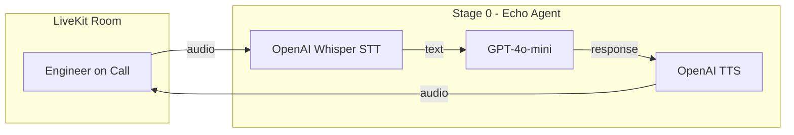
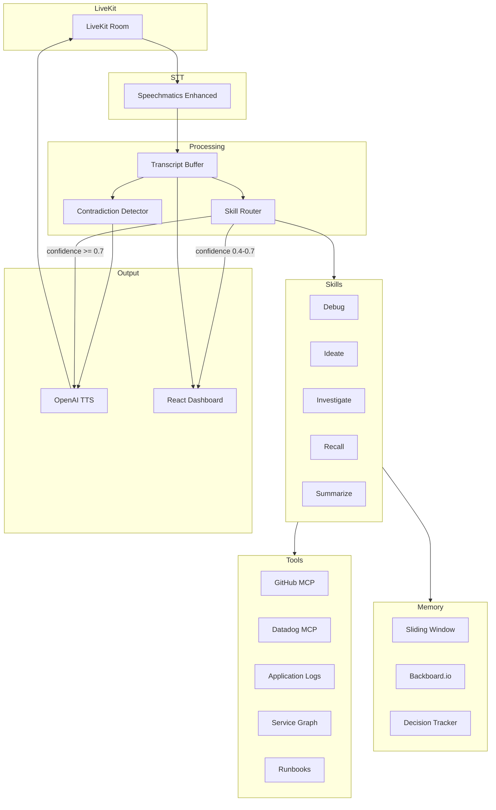

# Architecture

## System Overview

War Room Copilot is a voice-first AI agent for production incident war rooms.

## Current Stage: 0 — Echo Agent

The agent joins a LiveKit room, transcribes speech via OpenAI Whisper,
passes it through GPT-4o-mini (echo mode), and speaks back via OpenAI TTS.

### Components

| Component | File | Purpose |
|-----------|------|---------|
| Agent | `src/war_room_copilot/core/agent.py` | LiveKit agent entry point, `WarRoomAgent` class |
| Config | `src/war_room_copilot/config.py` | Environment variables and thresholds |
| Models | `src/war_room_copilot/models.py` | Shared Pydantic models |

### Data Flow

1. User speaks into LiveKit room
2. Silero VAD detects voice activity
3. OpenAI Whisper transcribes audio to text
4. GPT-4o-mini generates echo response
5. OpenAI TTS converts response to audio
6. Audio sent back to LiveKit room

## Planned Architecture (Full)

## Tech Decisions

| Decision | Choice | Rationale |
|----------|--------|-----------|
| Voice framework | LiveKit Agents | Real-time, open-source, good Python SDK |
| STT (Stage 0) | OpenAI Whisper | Simple, no extra API key needed |
| STT (Stage 1+) | Speechmatics | Enhanced mode, diarization, custom dictionary |
| LLM | OpenAI GPT-4o | Best tool-calling, fast enough for real-time |
| TTS | OpenAI TTS | Low latency, good quality |
| VAD | Silero | Lightweight, runs locally |
| Memory | Backboard.io | Cross-session persistence |
| Tracing | LangSmith | Production-grade, LangChain ecosystem |
| Dashboard | React + Vite + Tailwind | Fast dev, WebSocket support |
